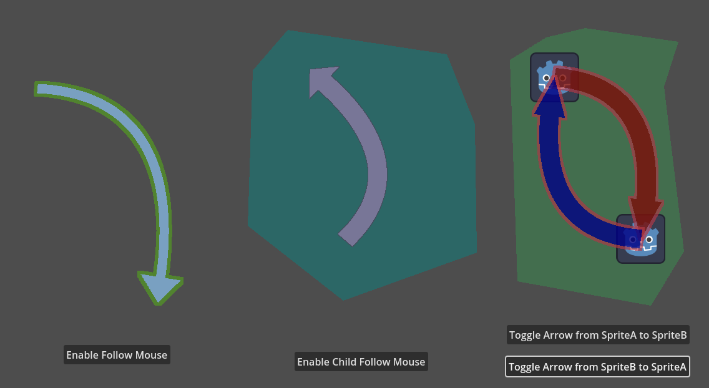
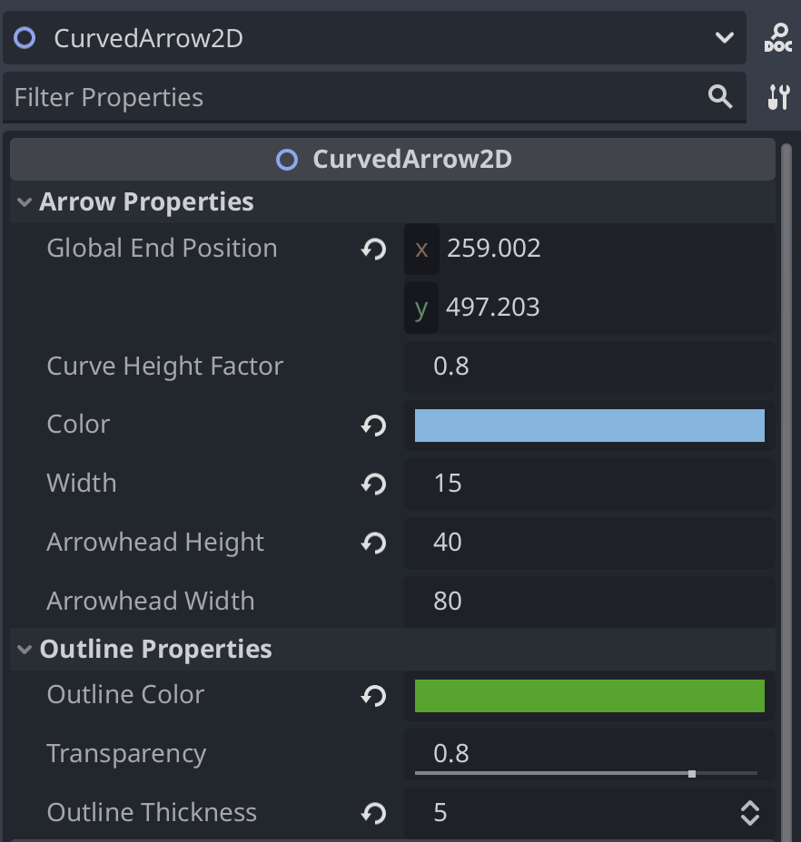

# Curved Arrow 2D Plugin for Godot 4.x

This Godot plugin adds a new node type called CurvedArrow2D. It allows you to create arrows with a bend 
in them, both in the scene editor and via code.



## Requirements

This plugin has been tested on Godot 4.3, but likely works with any 4.x version.

## Installation

Follow the instructions at the Godot docs for [installing a plugin](https://docs.godotengine.org/en/stable/tutorials/plugins/editor/installing_plugins.html#installing-a-plugin) to download an extract a zip to the right place.

## Usage via the Godot Editor

When in the *Create New Node* dialog, you should find a new node type called CurvedArrow2D (under Node2D).

The start of the arrow should be the position of the node; you can move it like any other node.

When selecting a CurvedArrow2D node in the scene tree, a white star will appear at the end of the arrow. 
Click and drag this star to change the location of the tip of the arrow.

### Other parameters

#### Arrow Properties

* `global_end_position: Vector2` - the global position of the tip of the arrow (same as dragging with the mouse)
* `curve_height_factor: float` - tune this up or down to increase or decrease the amount of bend. *NOTE:* setting this to a negative number will flip the bend of the curve to the opposite side.
* `color: Color` - main color of the arrow
* `width: float` - width of the arrow body, not including the head
* `arrowhead_height: float` - size from the base of the arrowhead to the tip
* `arrowhead_width: float` - size at the base of the arrowhead; note if this is smaller than half the width, the head will be inverted

#### Outline Properties
* `outline_color: Color`
* `transparency: float`
* `outline_thickness: int`



## Usage via scripting

Arrows can be created and manipulated in code. 

Creating an arrow on the fly and setting it to point from one node to another:

```
var arrow = CurvedArrow2D.new()
arrow.set_positions(node_a.global_position, node_b.global_position)
add_child(arrow)
```

Using mouse input to move around the tip of an arrow:

```
func _input(event: InputEvent) -> void:
    if event is InputEventMouseMotion:
        arrow.global_end_position = event.position
```

See [test_scene.gd](./test_scene.gd) for examples.

## Demo

You can check out this repo locally and run the test scene in Godot to try out a demo.

You can also see it in action in my current work-in-progress, [Hearts Attack: Tactical Solitaire](https://jlapier.itch.io/hearts-attack).

